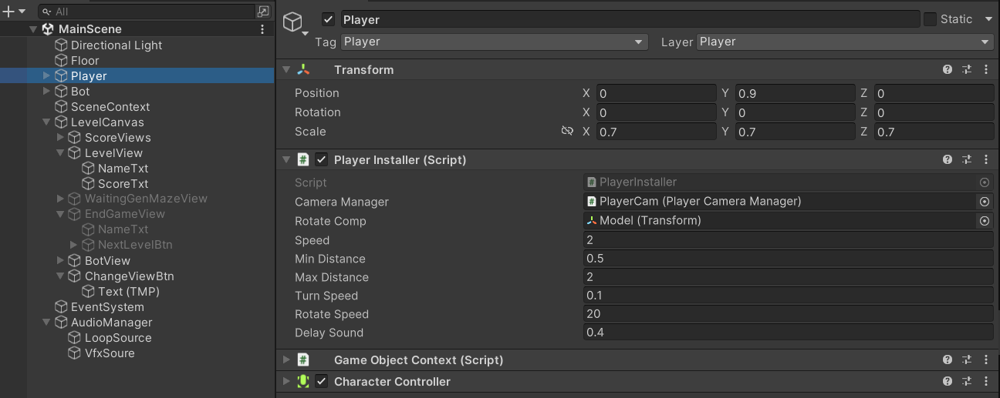
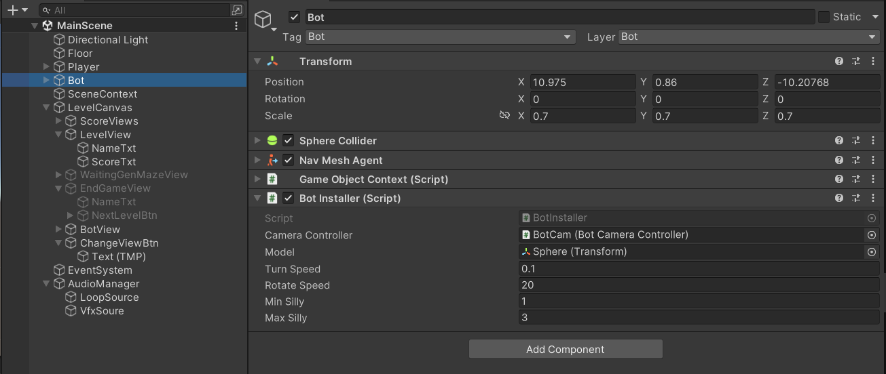
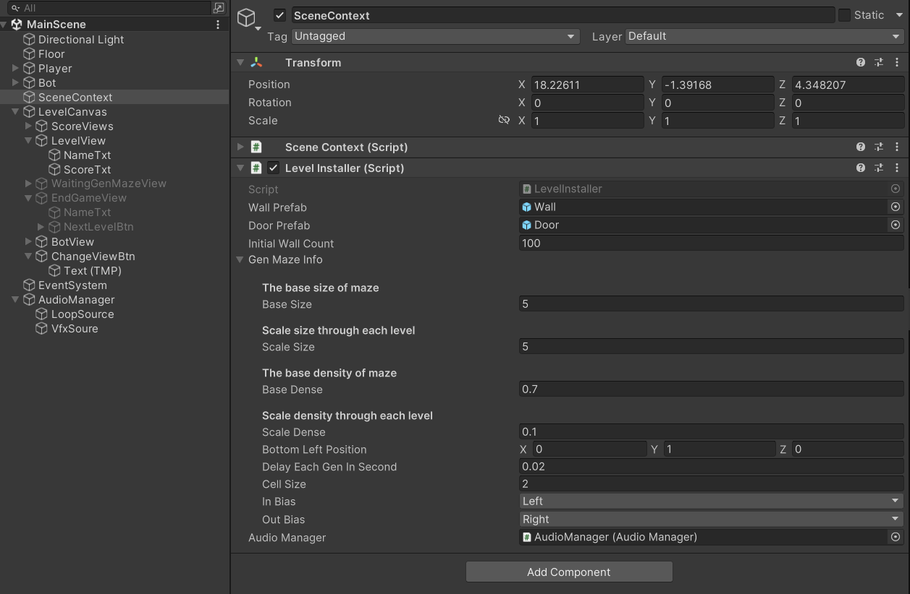

# NOTE: Use Unity 2022.3.1f1 (or other 2022 versions) to open the project
# How to play
Click on screen to let the ball roll to that position\
The first one roll to the door  wins the round\
Click on  or ***Space button*** to change the viewport

# Settings
## Player settings via *Player* object

## Bot settings via *Bot* object
Change the silly values to make the bot dumber 

## Maze settings via *SceneContext* object
Change the base size and scaled size (increasing size through each level) to make the maze larger
